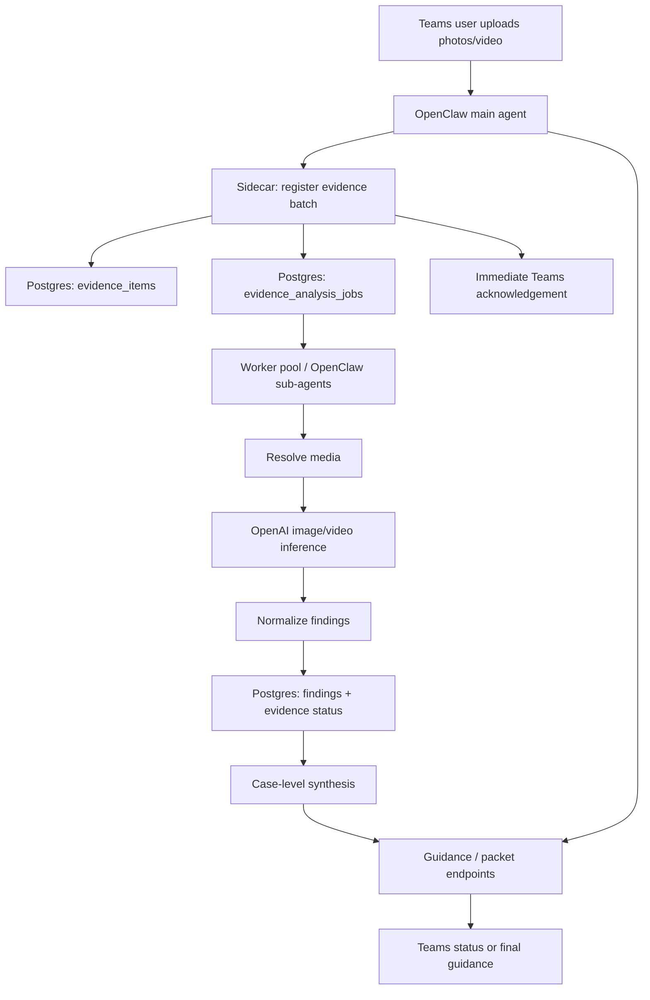

# Milestone 5: Async Evidence Processing And Field Acknowledgements

## Goal

Make photo and video analysis fast enough for real field use.

By the end of this milestone, a sales rep should be able to upload a batch of photos or a startup video in Microsoft Teams and receive an immediate case-aware acknowledgement while the actual image/video analysis runs asynchronously in parallel.

The main OpenClaw/Teams agent should not spend the user-facing turn working through each image one by one. It should register evidence with the sidecar, tell the rep processing has started, ask for the next useful field evidence, and then let durable background jobs or sub-agents complete the media analysis.

## Problem

The current live flow can feel too slow during field testing because the agent may process evidence sequentially inside the main conversation turn.

For example, if a sales rep uploads 12 combine photos and each photo takes a few minutes to resolve, analyze, normalize, and store, the user can experience a long blocked chat instead of a responsive field assistant.

That is especially painful in the intended setting:

- the rep is standing near the machine
- the customer may be nearby
- lighting, weather, and access may be changing
- the rep needs to keep taking photos while the workflow catches up

The UX target is:

```text
Got it. I added 12 photos to trade case TIA-1234ABCD.

I am processing them in the background now, so you can keep sending more.
Current priority: serial plate, hour display, feeder house close-up.
```

## Product Slice

> A sales rep starts or resumes a trade case in Teams, uploads multiple photos from an iPhone, receives an acknowledgement within a few seconds, and can continue sending evidence while the sidecar processes the batch in parallel and updates accepted/retake/missing guidance.

The field rep should always see:

- the durable case number
- how many items were registered
- whether processing has started
- what they should do next while processing continues
- a simple status summary when they ask "what do you have so far?"

The used evaluation team should eventually see:

- every evidence item
- processing status per item
- findings per completed item
- failed or unsupported media clearly marked
- final case-level synthesis once enough evidence is complete

## Design Principles

- The Teams/OpenClaw agent should never block the field user on per-image inference.
- The sidecar owns durable queue state, media state, findings, and case synthesis.
- Per-media analysis can run in parallel; final valuation/recon guidance must synthesize the full evidence package.
- A failed image should not block the rest of the batch.
- The system should be explicit about pending work instead of pretending the analysis is done.
- Concurrency should be capped to protect OpenAI spend, VM resources, and API rate limits.
- Chat memory is not workflow state; the sidecar remains the source of truth.

## Recommended Architecture



The key change is that evidence registration and evidence analysis become separate steps.

The main agent turn should do only:

1. Create or resume the active trade case.
2. Register the uploaded media as evidence.
3. Enqueue analysis jobs.
4. Return an immediate acknowledgement with case number and next field ask.

The background path should do:

1. Pick queued jobs with concurrency limits.
2. Resolve media from OpenClaw managed media paths, local file paths, or allowed URLs.
3. Send images or sampled video frames to the configured OpenAI model.
4. Persist findings, quality status, and failure details.
5. Recompute checklist/routing guidance as jobs complete.

## Sub-Agent Boundary

Use "sub-agent" as an execution strategy, not as the workflow state owner.

The sidecar should expose a small worker interface:

```text
EvidenceAnalysisWorker
  analyze(job)
  normalize(result)
  persist(result)
```

Initial implementation can use either:

- a sidecar-managed worker that calls the OpenAI API directly
- an OpenClaw sub-agent/task runner that receives one media-analysis job and posts the result back to the sidecar

The durable contract should be the same either way. If OpenClaw sub-agents are used, they should not rely on the main chat thread's memory. They should receive a job payload, process the media, and write structured results back through the sidecar.

This keeps day-to-day product logic in `trade-in-agent` while allowing OpenClaw to provide the asynchronous execution surface.

## Deliverables

1. Postgres-backed evidence analysis job table.
2. Async evidence registration path that returns immediately after queueing jobs.
3. Worker loop with configurable concurrency and retry behavior.
4. Optional OpenClaw sub-agent adapter behind the worker interface.
5. Case-level processing status endpoint.
6. Case-level synthesis refresh after each completed job.
7. Agent instruction updates so Teams replies acknowledge processing instead of waiting for all analysis.
8. Field-friendly status copy for queued, processing, complete, failed, and retake states.
9. Regression tests for batch queueing, idempotency, retries, and parallel processing.
10. Manual QA and Stotz VM deployment runbook updates.

## Implemented MVP Surface

The first implementation adds:

- migration `005_evidence_analysis_jobs.sql`
- `processingMode: "async"` support on `POST /trade-cases/:id/evidence/batch`
- `"async": true` support on `POST /trade-cases/:id/evidence/:evidenceId/analyze`
- `GET /trade-cases/:id/processing-status`
- `npm run worker`
- `npm run smoke:async`
- `trade-in-agent-worker.service`
- agent instructions that route Teams uploads through async registration before status/guidance

Async batch registration returns `caseNumber`, `registeredCount`, `queuedCount`, `processingSummary`, `nextEvidenceRequests`, and a field-ready `message`. Newly queued checklist slots are excluded from the immediate next-shot ask so the agent does not ask the rep to retake something that is merely still processing.

## Proposed Data Model

Add a dedicated job table instead of overloading `evidence_items.analysis_status`.

Recommended table:

```text
evidence_analysis_jobs
  id
  trade_case_id
  evidence_item_id
  job_type
  status
  priority
  attempts
  max_attempts
  locked_by
  locked_at
  started_at
  completed_at
  next_attempt_at
  timeout_at
  payload_json
  result_json
  error
  created_at
  updated_at
```

Recommended job statuses:

```text
queued
processing
succeeded
failed_retryable
failed_terminal
cancelled
```

`evidence_items.analysis_status` should remain the user-facing rollup:

```text
pending
queued
processing
complete
failed
unsupported
```

## Proposed API Changes

### Register Evidence Batch Async

Extend the existing batch registration endpoint:

```text
POST /trade-cases/:id/evidence/batch
```

Request addition:

```json
{
  "processingMode": "async",
  "items": []
}
```

Response should include:

```json
{
  "caseNumber": "TIA-1234ABCD",
  "registeredCount": 12,
  "queuedCount": 12,
  "processingSummary": {
    "queued": 12,
    "processing": 0,
    "complete": 0,
    "failed": 0
  },
  "nextEvidenceRequests": [],
  "message": "I added 12 photos to trade case TIA-1234ABCD and started processing them in the background."
}
```

### Queue One Evidence Item

Keep the existing analyze endpoint, but allow async mode:

```text
POST /trade-cases/:id/evidence/:evidenceId/analyze
```

Request:

```json
{
  "async": true,
  "analysisMode": "field_evidence_quality"
}
```

Response:

```json
{
  "caseNumber": "TIA-1234ABCD",
  "evidenceId": "uuid",
  "jobId": "uuid",
  "analysisStatus": "queued"
}
```

### Processing Status

Add:

```text
GET /trade-cases/:id/processing-status
```

Response:

```json
{
  "caseNumber": "TIA-1234ABCD",
  "summary": {
    "registered": 12,
    "queued": 2,
    "processing": 4,
    "complete": 5,
    "failed": 1
  },
  "evidence": [],
  "latestGuidance": {}
}
```

The Teams agent should use this endpoint when a user asks:

- "what do you have so far?"
- "are the photos done?"
- "what else do you need?"
- "did those pictures work?"

## Worker Implementation Spec

Start with a Postgres-backed queue because the sidecar already uses Postgres and the MVP runs on one VM.

Recommended implementation:

- use `SELECT ... FOR UPDATE SKIP LOCKED` to claim jobs
- default `TRADE_IN_ANALYSIS_CONCURRENCY=4`
- default per-case concurrency cap of 2 or 3
- exponential backoff for transient OpenAI/media failures
- terminal failure after a small fixed attempt count
- idempotency key based on trade case id, evidence id, job type, and media hash when available
- graceful shutdown so claimed jobs return to retryable status

For the production VM, prefer a separate process:

```text
trade-in-agent-sidecar.service
trade-in-agent-worker.service
```

Local development may run the worker in-process with the sidecar behind:

```text
TRADE_IN_WORKER_MODE=inline
```

Production should use:

```text
TRADE_IN_WORKER_MODE=separate
TRADE_IN_ANALYSIS_CONCURRENCY=4
TRADE_IN_ANALYSIS_PER_CASE_CONCURRENCY=2
```

## Agent Behavior

When the user uploads evidence, the main agent should reply quickly.

Good response:

```text
Trade case TIA-1234ABCD is open.

I added 8 new photos and started processing them in the background. You can keep sending more while I work through them.

Next best shots: serial plate, cab display with hours, and feeder house opening.
```

Status response while jobs are running:

```text
Trade case TIA-1234ABCD is still processing.

Complete: 5 photos
Processing: 3 photos
Needs retake so far: right side tire close-up

While that finishes, please send the serial plate and hour display.
```

Completion response:

```text
Trade case TIA-1234ABCD has 12 processed items.

Accepted: front 45, rear 45, left side, right side, cab display, feeder house.
Needs retake: startup video was too short to hear idle quality.
Still needed: serial plate close-up and engine compartment.
```

## Case-Level Synthesis

Per-image analysis can run in parallel, but route decisions and demo valuation/recon output should be case-level.

The sidecar should refresh guidance after each completed job, but it should label partial synthesis clearly:

```text
analysisCoverage: partial
```

Only mark a packet as ready when:

- required evidence is complete enough for the selected route
- no high-priority jobs are still queued or processing
- unsupported/failed items are either replaced or explicitly treated as limitations

## Video Handling

Startup videos should also use the async path.

For Milestone MVP:

- register the video immediately
- queue a video analysis job
- sample frames and/or use existing supported model video input where available
- produce a clear unsupported or needs-retake state if the video cannot be processed

The field reply should not wait for video analysis to finish.

## Observability

Add logs and status summaries that make slow field sessions diagnosable:

- jobs queued per case
- active worker count
- average media resolve time
- average OpenAI inference time
- retries and terminal failures
- OpenAI model used
- estimated token/image usage when available
- stuck job detector

Do not log:

- OpenAI API keys
- Teams signed URLs
- Graph tokens
- raw customer-sensitive media URLs

## Acceptance Criteria

- Uploading a 12-photo batch returns a Teams acknowledgement in under 10 seconds in normal VM conditions.
- The main agent can answer another Teams message while the batch is still processing.
- At least 4 image jobs can process concurrently when configured.
- Duplicate evidence registration does not create duplicate analysis jobs for the same media item.
- Failed media is marked clearly and does not block successful items.
- Guidance distinguishes pending analysis from completed findings.
- Packet generation either waits for required analysis or clearly states which evidence is still pending.
- Tests prove batch processing is parallel, not sequential.

## QA Plan

Automated tests:

- job table migration applies cleanly
- batch registration creates evidence rows and queued jobs
- duplicate batch registration is idempotent
- worker claims jobs with `SKIP LOCKED`
- worker respects global and per-case concurrency
- retryable failures back off and retry
- terminal failures roll up to evidence status
- case guidance updates after completed jobs
- processing status endpoint summarizes mixed queued/processing/complete/failed states

Local manual QA:

1. Start the sidecar and worker locally.
2. Create a trade case.
3. Register 12 fixture image paths with `processingMode=async`.
4. Confirm the registration response returns immediately with queued jobs.
5. Poll `/trade-cases/:id/processing-status`.
6. Confirm jobs complete in parallel.
7. Confirm `/trade-cases/:id/guidance` shows accepted, retake, missing, and pending states correctly.

Stotz Teams QA:

1. Start or resume a trade case in the Stotz Sales Agent Teams DM.
2. Upload 8-12 combine photos from an iPhone.
3. Confirm the agent replies quickly with case number, registered count, and next shot request.
4. Send "what do you have so far?" while processing is still running.
5. Confirm the agent returns processing counts and completed findings without waiting for the full batch.
6. After processing completes, ask for the current packet/guidance.
7. Confirm the packet includes completed findings and clear limitations for failed or unsupported media.

## Deployment Notes

Stotz VM deployment should add:

- worker systemd unit
- worker environment variables
- migration for `evidence_analysis_jobs`
- health check that reports worker queue depth
- runbook commands for restarting the worker separately from OpenClaw
- log commands for diagnosing stuck jobs

Service names:

```text
trade-in-agent-sidecar.service
trade-in-agent-worker.service
```

Useful worker environment variables:

```text
TRADE_IN_WORKER_MODE=separate
TRADE_IN_ANALYSIS_CONCURRENCY=4
TRADE_IN_ANALYSIS_PER_CASE_CONCURRENCY=2
TRADE_IN_ANALYSIS_JOB_TIMEOUT_MS=300000
TRADE_IN_WORKER_POLL_MS=3000
```

OpenClaw deployment changes should be limited to:

- sidecar/plugin timeout settings if needed
- environment variables for worker mode and concurrency
- tool instruction refresh so the agent uses async status endpoints
- optional sub-agent runner configuration if OpenClaw owns the worker execution surface

## Non-Goals

- Final approved trade valuation.
- Final approved reconditioning estimate.
- Reviewer UI.
- Machine Finder Pro sync.
- JDDO/Dynamics sync.
- Unlimited background concurrency.
- Proactive Teams push notifications unless OpenClaw supports them cleanly for the deployment.

## Future Enhancements

- Proactive Teams completion notifications when all jobs for a case finish.
- Reviewer dashboard live status.
- Priority boost for serial plate, hour display, startup video, and obvious damage evidence.
- Cancellation or archive behavior for abandoned cases.
- Azure queue or service bus if the workflow grows beyond one VM.
- Batch-level cost estimates and budget controls.
